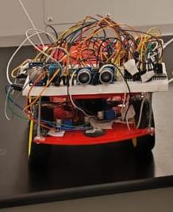
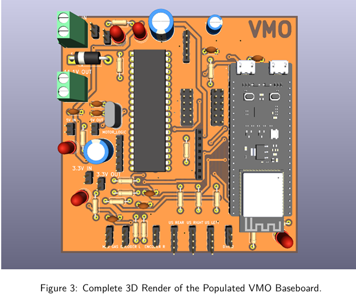

# 🤖 VMO — Autonomous Home Pet & Safety Monitoring Robot


### Autonomous Robotics • Embedded Systems • Edge AI • ROS 2 • IoT

<br>


<br>

**A heterogeneous autonomous robot combining embedded intelligence, robotics, computer vision, and AI to create a smart home monitoring companion.**

</div>

---

# 🌟 Project Overview

**VMO (Virtual Monitoring Operator)** is an autonomous mobile robot designed to provide intelligent home monitoring while acting as an interactive robotic companion.

The robot combines:

- Real-time embedded control
- Edge AI perception
- Autonomous navigation
- IoT connectivity
- Voice interaction
- Cloud monitoring

Unlike traditional robotic systems that rely on a single processor, VMO uses a **distributed computing architecture**, where each processing unit handles tasks according to its computational requirements.

This design ensures:

✅ Deterministic motor control  
✅ Efficient AI processing  
✅ Reliable communication  
✅ Scalable robotic architecture  

---

# 🎯 System Capabilities

| Capability | Implementation |
|---|---|
| Autonomous navigation | ROS 2 control pipeline |
| Human detection | YOLO26 Nano + ONNX Runtime |
| Obstacle avoidance | Ultrasonic sensor array |
| Environmental monitoring | MQ-2 + DHT11 sensors |
| Voice interaction | Speech Recognition + Gemini API |
| Cloud monitoring | Firebase IoT synchronization |
| Real-time control | PIC16F877A firmware |
| Middleware communication | ESP32-S3 + FreeRTOS |

---

# 🧠 System Architecture

VMO follows a four-layer heterogeneous architecture:

```text

                 📱 Android Smartphone
        Voice Assistant • Face Animation • UI
                         │
                         │ Local Network
                         ▼

                🧠 Raspberry Pi 4
       ROS 2 • YOLO Vision • Navigation • Cloud
                         │
                         │ USB Serial
                         ▼

                ⚡ ESP32-S3
       FreeRTOS • Communication Middleware
                         │
                         │ UART
                         ▼

                🔧 PIC16F877A
      Real-Time Sensors • PWM • Motor Control


```

---

# 🏗 Hardware Architecture

## Processing Units

| Layer | Component | Responsibility |
|-|-|-|
| Brain Layer | Raspberry Pi 4 | AI inference, ROS 2, navigation |
| Middleware Layer | ESP32-S3 | Communication and task scheduling |
| Real-Time Layer | PIC16F877A | Sensors and motor control |
| Interface Layer | Android Smartphone | Voice and visual interaction |

---

## Sensors

- 🔥 MQ-2 Gas Detection Sensor
- 🌡 DHT11 Temperature & Humidity Sensor
- 📡 HC-SR04 Ultrasonic Sensor Array
- ⚙️ Optical Wheel Encoders

---

## Actuation

- Differential drive motors
- L298N motor driver
- PWM motor control

---

## Power System

- 11.1V 3S LiPo Battery
- Battery Management System
- INA226 Power Monitoring
- 5V / 3.3V Buck Regulation

---

# 🤖 AI & Robotics Pipeline

## Computer Vision

VMO uses an optimized edge AI pipeline:

```
Camera Input
      │
      ▼
Frame Optimization
      │
      ▼
YOLO26 Nano Detection
      │
      ▼
ROS 2 Decision Layer
      │
      ▼
Motor Commands
```

A custom frame-processing algorithm reduces unnecessary inference operations to maintain real-time performance on Raspberry Pi hardware.

---

# ⚙️ Technology Stack

| Field | Technologies |
|-|-|
| Embedded Systems | PIC16F877A, ESP32-S3, FreeRTOS |
| Robotics | ROS 2 Humble, Docker |
| AI / Vision | YOLO26 Nano, OpenCV, ONNX Runtime |
| Programming | C, C++, Python |
| Communication | UART, UDP, Protobuf, COBS |
| Cloud | Firebase |
| Voice AI | Speech API, Gemini API |
| PCB Design | KiCad |
| Simulation | Proteus |

---

# 📂 Repository Structure

```text
VMO-Autonomous-Home-Monitoring-Robo

│
├── README.md
│
├── images
│   ├── Robot.jpeg
│   ├── PCB.png
│   └── Protus Simulation.png
│
├── Report
│   └── Technical Documentation.pdf
│
├── Software_and_Firmware
│   ├── ESP32_Code
│   ├── PIC_Code
│   └── Dockerfile
│
└── Hardware_and_Simulation
    ├── PCB Design Files
    └── Proteus Simulation
```

---

# 🔌 PCB Design

Custom PCB design was developed to integrate:

- Power management
- Logic-level conversion
- Microcontroller communication
- Sensor interfaces

<p align="center">

</p>

---

# 🚀 Engineering Highlights

### ⚡ Real-Time Embedded Design
- Cooperative scheduling on PIC16F877A
- FreeRTOS task management on ESP32-S3
- Interrupt-based communication

### 🧠 Edge AI Optimization
- Lightweight YOLO deployment
- ONNX Runtime inference
- Efficient frame processing

### 🔗 Reliable Communication
- UART communication
- Protobuf serialization
- COBS encoding
- Error detection mechanisms

### 🤖 Autonomous Robotics
- ROS 2 architecture
- Differential drive kinematics
- Sensor-based decision making

---

# 📸 Project Gallery

## Robot Prototype

<p align="center">

</p>


## PCB 3D Design

<p align="center">

</p>


---


<div align="center">

⭐ If you find this project interesting, feel free to explore the repository.

</div>
